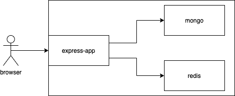

# To Do (Single-Page App) - Microservice

Basic todo application demonstrating the microservice architecutre by deploying the frontend, the backend, the database, and cache all as its own service while providing an Nginx proxy-server as a defualt gateway to the app.

## Architecture

The client first communicates with the Nginx proxy server to get initial single page data. The proxy-server acts as an CDN.

Then the app starts fetching data from the backend (express-app)

The backend uses MongoDB as a permanenat store. data are presisted locally using docker volumes. Redis DB is used for caching

The containers use the default network bridge for communication with DNS lookups provided by docker.

## Getting Started (Docker)
